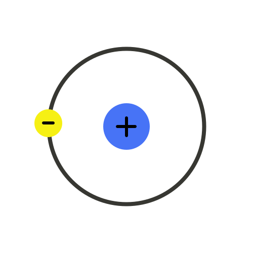

<div align="center">
 

## 200 Lines vs. DPI: The Protocol-Less, User-Defined VPN
</div>

*  **English:** Bypass internet censorship. A VPN is just **200 lines of code**, not a bloated suite like Xray.
*  **中文 (Chinese):** 绕过网络封锁。VPN 只需要 **200 行代码**，而不是像 Xray 那样臃肿的套件。
*  **हिन्दी (Hindi):** इंटरनेट सेंसरशिप को बायपास करना。VPN केवल **200 लाइनों का कोड** है, न कि Xray जैसा भारी-भरकम सॉफ्टवेयर。
*  **Español:** Evitar la censura de internet. Una VPN son solo **200 líneas de código**, no suites pesadas como Xray.
*  **Français:** Contourner la censure d'internet. Un VPN, c'est juste **200 lignes de code**, pas des « usines à gaz » comme Xray.
*  **العربية (Arabic):** تجاوز رقابة الإنترنت. الـ VPN هو مجرد **200 سطر من التعليمات البرمجية**， وليس حزمة برمجية ضخمة مثل Xray。
*  **Русский:** Обход блокировок интернета. VPN — это **всего 200 строк кода**, а не те «комбайны» вроде Xray.
  
### 🔗 Share
> [!NOTE]
> | :octocat: Github Lovers | 📢 Usual People |
> | :-: | :-: |
> | [This Page](https://github.com/sivpn/sivpn.github.io/) | [Go To Landing Page](https://sivpn.github.io/) |

#### :octocat: Repository For Github Lovers
```text
https://github.com/sivpn/sivpn.github.io/
```
#### 📢 Landing Page For Usual People
```text
https://sivpn.github.io/
```

# ❓FAQ
🌐 *Select your language:*

<details>
    <summary>  English</summary>

### What is it?
This is a public initiative aimed at demonstrating that current VPN solutions, such as OpenVPN and WireGuard, are unnecessarily overcomplicated.
It turns out that a savvy teenager can write their own VPN protocol with the help of AI.

### Why build my own protocol? What will it give me?
It opens up incredible possibilities: you can implement the wildest ideas you can think of. For example, you could turn your VPN into a "document transfer" stream by embedding network bytes directly into the structure of a Word file.
And that is just one of thousands of potential ideas. Moreover, the uniqueness of your protocol ensures that your VPN’s signatures will be absent from any censorship databases.

### How does a "custom protocol" work?
It’s simpler than it seems. The very essence of a VPN is routing data from computer A to computer C through computer B. And all of this logic takes only about 200 lines in a modern programming language.
This isn’t some complex C++ with obscure libraries. The code is easy to read, almost like JavaScript, so anyone who has worked in a console, even a little, will be able to understand it.

| Name | Benefit |
| :-: | :-: |
| [**simplest-vpn**](https://github.com/developer3389/simplest-vpn) | A working VPN tunnel: just 200 lines of code |
| [**vpn-dev-guide**](https://github.com/developer3389/vpn-dev-guide) | Start building your own VPN protocol with AI |
| [**vpn-gateway**](https://github.com/developer3389/vpn-gateway) | Share VPN from an old laptop to home devices |
| [**network-censorship-analysis**](https://github.com/developer3389/network-censorship-analysis) | How not to get your *sivpn* flagged |
| [**internet-blocking-bypass**](https://github.com/developer3389/awesome-internet-blocking-bypass) | Useful tools you've never heard of |
| [**wayback-mirror**](https://github.com/developer3389/wayback-mirror) | Archive mirror for instructions |

### Why is the project updated so frequently and promoted so aggressively?
The principle is simple: if every user creates their own individual VPN-protocol, the censorship system will choke. Censors are limited by their cognitive and technical resources—they cannot handle millions of unique, "home-grown" protocols in real-time.
Of course, we couldn't let these ideas get lost on the 1,778th page of search results, so we update the repository every hour. Even if it looks like spam, it’s our way of ensuring that this tool is always within reach for those who need it.

### Is it free?
Absolutely. It is an open-source project, not a product.

### Is it service?
No. Every user acts as their own service provider. There is no central server to pay for or be tracked by.

### Does it track my data?
No. You are your own master. Since you host the gateway, you are the only one with access to your connection logs. We don't have access to them.

### Can I install it on my phone?
Not exactly, but this is designed to be installed on a "bridge" (your laptop or router) to cover all your devices, including phones, at once.

### Is it legally?
Most likely yes, unless you live in North Korea. However, always check your local laws to be sure.

### Why *sivpn?*

It’s an abbreviation for [simplest-vpn](https://github.com/developer3389/simplest-vpn). That’s it.

### Why is it so simple?
Because complex things are fragile. We believe in minimal, reliable code that just works.

### Who is the author?
The initial concept comes from [developer3389](https://github.com/developer3389/).  
We are just a group of volunteers who saw the potential, got inspired, and decided to build a beautiful page for it.

### I have another question
Open an [Issue](https://github.com/sivpn/sivpn.github.io/issues/) on GitHub. We don't bite.
</details>

---

<details>
    <summary>  中文 (Chinese)</summary>

### 这是一个什么项目？
这是一个公共倡议，旨在证明现有的 VPN 解决方案（如 OpenVPN 和 WireGuard）过于复杂。
事实证明，一个精通技术的青少年完全可以在 AI 的帮助下编写出属于自己的 VPN 协议。

### 为什么要创建我自己的协议？这能带来什么？
这为你提供了无限的工程创造空间：你可以实现任何你能想到的疯狂点子。例如，你可以通过将网络字节直接嵌入 Word 文档结构中，将 VPN 伪装成“文档传输”流。
这只是成千上万种可能方案中的一种。此外，你协议的独特性保证了你的 VPN 特征（Signature）不会出现在任何审查数据库中。

### “自己的协议”到底是什么意思？
这比看起来要简单得多。VPN 的本质就是通过计算机 B 将数据从计算机 A 传输到计算机 C。而在现代编程语言中，实现这一逻辑总共只需约 200 行代码。
这并不是什么带有晦涩库的复杂 C++ 程序。代码非常易读，几乎和 JavaScript 一样，因此任何稍微用过命令行的人都能看懂。

| 名称 | 作用 |
| :-: | :-: |
| [**simplest-vpn**](https://github.com/developer3389/simplest-vpn) | 一个可用的 VPN 隧道：代码仅 200 行 |
| [**vpn-dev-guide**](https://github.com/developer3389/vpn-dev-guide) | 开始用人工智能构建你自己的 VPN 协议 |
| [**vpn-gateway**](https://github.com/developer3389/vpn-gateway) | 旧笔记本电脑共享 VPN 给全家 |
| [**network-censorship-analysis**](https://github.com/developer3389/network-censorship-analysis) | 如何防止您的 *sivpn* 被标记 |
| [**internet-blocking-bypass**](https://github.com/developer3389/awesome-internet-blocking-bypass) | 鲜为人知的实用工具 |
| [**wayback-mirror**](https://github.com/developer3389/wayback-mirror) | 预防指令页面被封锁的镜像 |

### 为什么该项目更新如此频繁且推广力度这么大？
原则很简单：如果每个用户都建立自己的独立 VPN 协议，审查系统就会因过载而瘫痪。审查者的认知能力和技术资源是有限的——他们无法实时处理数以百万计的独特“自制”协议。
当然，我们不能让这些想法淹没在搜索结果的第 1778 页，因此我们每小时更新一次代码库。即便这看起来像是垃圾信息，也是我们确保工具始终能被需要的人找到的唯一方式。

### 它是免费的吗？
绝对免费。这是一个开源项目，而不是商业产品。

### 它是一个服务吗？
不是。每个用户都是自己的服务提供商。没有需要付费的中央服务器，也不会被任何第三方追踪。

### 它会追踪我的数据吗？
不会。你才是自己的主人。因为网关是你自己架设的，只有你能访问连接日志。我们无法访问你的任何数据。

### 我可以把它安装在手机上吗？
不完全是，但该项目旨在安装在“桥接设备”（如你的笔记本电脑或路由器）上，从而一次性覆盖你家中所有的设备，包括手机。

### 这合法吗？
在大多数国家是合法的（除非你住在朝鲜）。不过，为了保险起见，请务必查看当地法律法规。

### 为什么叫 *sivpn*？
这是 [simplest-vpn](https://github.com/developer3389/simplest-vpn) 的缩写。就是这么简单。

### 为什么它如此简单？
因为复杂的东西往往很脆弱。我们坚信简洁、可靠的代码才是最有效的。

### 作者是谁？
最初的概念来自 [developer3389](https://github.com/developer3389/)。
我们只是一群志愿者，看到了这个项目的潜力，深受启发，并决定为它建立一个美观的页面。

### 我还有其他问题
在 GitHub 上开一个 [Issue](https://github.com/sivpn/sivpn.github.io/issues/) 即可。我们很友好的。
</details>

---

<details>
    <summary>  हिन्दी (Hindi)</summary>

### यह क्या है?
यह एक सार्वजनिक पहल है जिसका उद्देश्य यह प्रदर्शित करना है कि वर्तमान VPN समाधान, जैसे कि OpenVPN और WireGuard, अनावश्यक रूप से बहुत जटिल हैं।
यह साबित हो गया है कि एक समझदार किशोर AI की मदद से अपना खुद का VPN प्रोटोकॉल लिख सकता है।

### मुझे अपना खुद का प्रोटोकॉल क्यों बनाना चाहिए? इससे मुझे क्या मिलेगा?
यह आपको असीमित इंजीनियरिंग रचनात्मकता (engineering creativity) का अवसर देता है: आप अपने मन में आने वाले सबसे 'पागलपन भरे' (wildest) आइडियाज को लागू कर सकते हैं। उदाहरण के लिए, आप नेटवर्क बाइट्स को सीधे Word फ़ाइल के स्ट्रक्चर में डालकर अपने VPN को "डॉक्यूमेंट ट्रांसफर" स्ट्रीम के रूप में बदल सकते हैं।
यह तो हज़ारों संभावित संभावनाओं में से बस एक है। इसके अलावा, आपके प्रोटोकॉल की विशिष्टता (uniqueness) यह सुनिश्चित करती है कि आपके VPN के सिग्नेचर किसी भी सेंसरशिप डेटाबेस में मौजूद नहीं होंगे।

### "अपना प्रोटोकॉल" यह क्या है?
यह जितना दिखता है, उससे कहीं अधिक सरल है। VPN का मूल सार डेटा को कंप्यूटर A से कंप्यूटर B के माध्यम से कंप्यूटर C तक पहुँचाना है। और आधुनिक प्रोग्रामिंग भाषा में यह पूरा लॉजिक केवल 200 लाइनों में आ जाता है।
यह किसी अस्पष्ट लाइब्रेरी वाला जटिल C++ नहीं है। कोड को पढ़ना आसान है, लगभग JavaScript की तरह, इसलिए जो कोई भी कंसोल (console) में थोड़ा-बहुत काम कर चुका है, वह इसे आसानी से समझ सकता है।

| नाम | लाभ |
| :-: | :-: |
| [**simplest-vpn**](https://github.com/developer3389/simplest-vpn) | एक वर्किंग VPN टनल: केवल 200 लाइनों का कोड |
| [**vpn-dev-guide**](https://github.com/developer3389/vpn-dev-guide) | AI की मदद से अपना खुद का VPN प्रोटोकॉल बनाना शुरू करें |
| [**vpn-gateway**](https://github.com/developer3389/vpn-gateway) | पुराने लैपटॉप से घर में VPN शेयर करें |
| [**network-censorship-analysis**](https://github.com/developer3389/network-censorship-analysis) | अपने *sivpn* को पहचाने जाने से कैसे बचाएं |
| [**internet-blocking-bypass**](https://github.com/developer3389/awesome-internet-blocking-bypass) | उपयोगी और गुप्त उपकरण |
| [**wayback-mirror**](https://github.com/developer3389/wayback-mirror) | निर्देश पाने का आर्काइव मिरर |

### यह प्रोजेक्ट इतनी बार अपडेट और प्रमोट क्यों किया जाता है?
सिद्धांत सरल है: यदि प्रत्येक उपयोगकर्ता अपना स्वयं का व्यक्तिगत VPN-प्रोटोकॉल बनाता है, तो सेंसरशिप सिस्टम ठप हो जाएगा। सेंसर करने वालों की संज्ञानात्मक और तकनीकी क्षमताएँ सीमित हैं—वे वास्तविक समय में लाखों अनूठे "घरेलू" प्रोटोकॉल को नहीं संभाल सकते।
बेशक, हम इन विचारों को खोज परिणामों के 1778वें पन्ने पर खो जाने नहीं दे सकते थे, इसलिए हम हर घंटे रिपॉजिटरी अपडेट करते हैं। भले ही यह स्पैम जैसा लगे, लेकिन यह सुनिश्चित करने का हमारा तरीका है कि यह टूल हमेशा उन लोगों की पहुँच में रहे जिन्हें इसकी आवश्यकता है।

### क्या यह मुफ्त है?
बिल्कुल। यह एक ओपन-सोर्स प्रोजेक्ट है, कोई उत्पाद नहीं।

### क्या यह कोई सर्विस है?
नहीं। प्रत्येक उपयोगकर्ता अपना स्वयं का सेवा प्रदाता (service provider) है। यहाँ कोई केंद्रीय सर्वर नहीं है जिसके लिए भुगतान करना पड़े या जो आपको ट्रैक कर सके।

### क्या यह मेरे डेटा को ट्रैक करता है?
नहीं। आप अपने खुद के मालिक हैं। चूँकि आप गेटवे को होस्ट करते हैं, इसलिए केवल आपके पास ही अपने कनेक्शन लॉग्स तक पहुँच होती है। हमारी उन तक कोई पहुँच नहीं है।

### क्या मैं इसे अपने फोन पर इंस्टॉल कर सकता हूँ?
नहीं, बिल्कुल नहीं, लेकिन इसे एक "ब्रिज" (जैसे आपका लैपटॉप या राउटर) पर इंस्टॉल करने के लिए डिज़ाइन किया गया है ताकि आपके सभी डिवाइस, फोन सहित, एक साथ कवर हो सकें।

### क्या यह कानूनी है?
ज्यादातर मामलों में हाँ, जब तक कि आप उत्तर कोरिया में नहीं रह रहे हैं। हालाँकि, सुनिश्चित होने के लिए हमेशा अपने स्थानीय कानूनों की जाँच करें।

### *sivpn* क्यों?
यह [simplest-vpn](https://github.com/developer3389/simplest-vpn) का संक्षिप्त रूप (abbreviation) है। बस इतना ही।

### यह इतना सरल क्यों है?
क्योंकि जटिल चीजें नाजुक होती हैं। हम न्यूनतम, विश्वसनीय कोड में विश्वास करते हैं जो बस काम करता है।

### लेखक कौन है?
मूल अवधारणा [developer3389](https://github.com/developer3389/) से आती है।
हम सिर्फ स्वयंसेवकों का एक समूह हैं जिन्होंने इसकी क्षमता देखी, प्रेरित हुए, और इसके लिए एक सुंदर पेज बनाने का निर्णय लिया।

### मेरे पास एक और सवाल है
GitHub पर एक [Issue](https://github.com/sivpn/sivpn.github.io/issues/) खोलें। हम काटते नहीं हैं।
</details>

---

<details>
    <summary>  Español (Spanish)</summary>

### ¿Qué es esto?
Es una iniciativa pública cuyo objetivo es demostrar que las soluciones VPN actuales, como OpenVPN y WireGuard, son innecesariamente complicadas.
Resulta que un adolescente avispado puede escribir su propio protocolo VPN con la ayuda de la IA.

### ¿Por qué crear mi propio protocolo? ¿Qué me aporta?
Esto te abre un mundo de posibilidades: puedes implementar las ideas más locas que se te ocurran. Por ejemplo, podrías transformar tu VPN en un flujo de "transferencia de documentos" incrustando los bytes de red directamente en la estructura de un archivo de Word.
Y eso es solo una de miles de posibilidades. Además, la singularidad de tu protocolo garantiza que las firmas (signatures) de tu VPN estarán ausentes en cualquier base de datos de censura.

### ¿Cómo funciona un "protocolo propio"?
Es más sencillo de lo que parece. La esencia misma de una VPN es la transferencia de datos desde el equipo A al equipo C a través del equipo B. Y toda esta lógica solo requiere unas 200 líneas en un lenguaje de programación moderno.
No se trata de un C++ complejo con librerías incomprensibles. El código es fácil de leer, casi como JavaScript, por lo que cualquiera que haya trabajado un poco con la consola podrá entenderlo.

| Nombre | Beneficio |
| :-: | :-: |
| [**simplest-vpn**](https://github.com/developer3389/simplest-vpn) | Un túnel VPN funcional: solo 200 líneas de código |
| [**vpn-dev-guide**](https://github.com/developer3389/vpn-dev-guide) | Empieza a crear tu propio protocolo VPN con IA |
| [**vpn-gateway**](https://github.com/developer3389/vpn-gateway) | Comparte VPN desde un portátil viejo |
| [**network-censorship-analysis**](https://github.com/developer3389/network-censorship-analysis) | Cómo evitar que detecten tu *sivpn* |
| [**internet-blocking-bypass**](https://github.com/developer3389/awesome-internet-blocking-bypass) | Herramientas útiles poco conocidas |

### ¿Por qué el proyecto se actualiza tan seguido y se promociona de forma tan agresiva?
El principio es sencillo: si cada usuario crea su propio protocolo VPN individual, el sistema de censura colapsará. Los censores tienen capacidades cognitivas y recursos técnicos limitados; no pueden procesar millones de protocolos únicos y «caseros» en tiempo real.
Por supuesto, no podíamos permitir que estas ideas se perdieran en la página 1778 de los resultados de búsqueda, así que actualizamos el repositorio cada hora. Incluso si esto parece spam, es nuestra forma de garantizar que esta herramienta esté siempre al alcance de quienes la necesitan.

### ¿Es gratis?
Absolutamente. Es un proyecto de código abierto, no un producto comercial.

### ¿Es un servicio?
No. Cada usuario actúa como su propio proveedor de servicios. No hay un servidor central por el que pagar ni que pueda rastrearte.

### ¿Rastrea mis datos?
No. Eres tu propio dueño. Dado que tú alojas la puerta de enlace (gateway), eres el único con acceso a los registros de tu conexión. Nosotros no tenemos acceso a ellos.

### ¿Puedo instalarlo en mi teléfono?
No exactamente, pero está diseñado para instalarse en un "puente" (tu portátil o router) para cubrir todos tus dispositivos, incluidos los teléfonos, de una sola vez.

### ¿Es legal?
Lo más probable es que sí, a menos que vivas en Corea del Norte. Sin embargo, comprueba siempre la legislación local para estar seguro.

### ¿Por qué *sivpn*?
Es una abreviatura de [simplest-vpn](https://github.com/developer3389/simplest-vpn). Eso es todo.

### ¿Por qué es tan sencillo?
Porque las cosas complejas son frágiles. Creemos en un código minimalista y fiable que simplemente funcione.

### ¿Quién es el autor?
El concepto inicial proviene de [developer3389](https://github.com/developer3389/).
Somos solo un grupo de voluntarios que vimos el potencial, nos sentimos inspirados y decidimos crear una página atractiva para ello.

### Tengo otra pregunta
Abre un [Issue](https://github.com/sivpn/sivpn.github.io/issues/) en GitHub. No mordemos.
</details>

---

<details>
    <summary>  Français (French)</summary>

### Qu'est-ce que c'est ?
Il s'agit d'une initiative publique visant à démontrer que les solutions VPN actuelles, telles qu'OpenVPN et WireGuard, sont inutilement complexes.
Il s'avère qu'un adolescent débrouillard peut écrire son propre protocole VPN avec l'aide de l'IA.

### Pourquoi créer mon propre protocole ? Qu'est-ce que cela m'apporte ?
Cela vous ouvre un champ de possibilités illimitées : vous pouvez mettre en œuvre les idées les plus folles qui vous passent par la tête. Par exemple, vous pourriez transformer votre VPN en un flux de « transfert de documents » en intégrant les octets réseau directement dans la structure d'un fichier Word.
Ce n'est qu'une possibilité parmi des milliers d'autres. De plus, l'unicité de votre protocole garantit que les signatures de votre VPN seront absentes de toutes les bases de données de censure.

## Comment fonctionne un "protocole maison" ?
C'est plus simple qu'il n'y paraît. L'essence même d'un VPN est le transfert de données de l'ordinateur A à l'ordinateur C via l'ordinateur B. Et toute cette logique ne prend qu'environ 200 lignes dans un langage de programmation moderne.
Ce n'est pas du C++ complexe avec des bibliothèques obscures. Le code est facile à lire, presque comme du JavaScript, donc quiconque a un peu travaillé avec une console pourra le comprendre.

| Nom | Bénéfice |
| :-: | :-: |
| [**simplest-vpn**](https://github.com/developer3389/simplest-vpn) | Un tunnel VPN fonctionnel : seulement 200 lignes de code |
| [**vpn-dev-guide**](https://github.com/developer3389/vpn-dev-guide) | Commencez à créer votre propre protocole VPN avec l'IA |
| [**vpn-gateway**](https://github.com/developer3389/vpn-gateway) | Partagez le VPN depuis un vieux PC |
| [**network-censorship-analysis**](https://github.com/developer3389/network-censorship-analysis) | Éviter la détection *sivpn* |
| [**internet-blocking-bypass**](https://github.com/developer3389/awesome-internet-blocking-bypass) | Outils utiles méconnus |
| [**wayback-mirror**](https://github.com/developer3389/wayback-mirror) | Miroir des instructions |

### Pourquoi le projet est-il mis à jour si souvent et promu de manière aussi agressive ?
Le principe est simple : si chaque utilisateur crée son propre protocole VPN individuel, le système de censure finira par saturer. Les censeurs disposent de ressources cognitives et techniques limitées ; ils ne peuvent pas traiter des millions de protocoles uniques « faits maison » en temps réel.
Bien entendu, nous ne pouvions pas laisser ces idées se perdre à la 1778ᵉ page des résultats de recherche, c'est pourquoi nous mettons à jour le dépôt chaque heure. Même si cela ressemble à du spam, c'est notre façon de garantir que cet outil soit toujours à portée de main pour ceux qui en ont besoin.

### Est-ce gratuit ?
Absolument. Il s'agit d'un projet open-source, et non d'un produit commercial.

### Est-ce un service ?
Non. Chaque utilisateur agit en tant que son propre fournisseur de services. Il n'y a aucun serveur central à payer et aucune possibilité d'être suivi.

### Est-ce que cela suit mes données ?
Non. Vous êtes votre propre maître. Comme vous hébergez la passerelle (gateway), vous êtes le seul à avoir accès à vos journaux de connexion. Nous n'y avons pas accès.

### Puis-je l'installer sur mon téléphone ?
Pas exactement, mais il est conçu pour être installé sur un « pont » (votre ordinateur portable ou votre routeur) afin de couvrir tous vos appareils, y compris les téléphones, en une seule fois.

### Est-ce légal ?
Très probablement oui, sauf si vous vivez en Corée du Nord. Cependant, vérifiez toujours vos lois locales pour en être sûr.

### Pourquoi *sivpn* ?
C'est une abréviation de [simplest-vpn](https://github.com/developer3389/simplest-vpn). C'est tout.

### Pourquoi est-ce si simple ?
Parce que les choses complexes sont fragiles. Nous croyons en un code minimaliste et fiable qui fonctionne tout simplement.

### Qui est l'auteur ?
Le concept initial provient de [developer3389](https://github.com/developer3389/).
Nous ne sommes qu'un groupe de bénévoles qui avons vu le potentiel, avons été inspirés et avons décidé de créer une belle page pour ce projet.

### J'ai une autre question
Ouvrez une [Issue](https://github.com/sivpn/sivpn.github.io/issues/) sur GitHub. Nous ne mordons pas.
</details>

---

<details>
    <summary>  العربية (Arabic)</summary>

### ما هذا المشروع؟
هذه مبادرة عامة تهدف إلى إثبات أن حلول VPN الحالية، مثل OpenVPN وWireGuard، معقدة بشكل غير ضروري.
لقد تبين أن بإمكان مراهق ذكي كتابة بروتوكول VPN الخاص به بمساعدة الذكاء الاصطناعي.

### لماذا أقوم ببناء بروتوكولي الخاص؟ وما هي الفائدة من ذلك؟
هذا يفتح أمامك آفاقاً لا محدودة من الإمكانيات الهندسية: يمكنك تنفيذ أكثر الأفكار جنوناً التي قد تخطر ببالك. على سبيل المثال، يمكنك تحويل الـ VPN الخاص بك إلى تدفق "نقل مستندات" من خلال تضمين بايتات الشبكة مباشرة في هيكل ملف Word.
وهذه مجرد فكرة واحدة من بين آلاف الأفكار الممكنة. علاوة على ذلك، فإن تفرد بروتوكولك يضمن أن توقيعات (Signatures) الـ VPN الخاص بك ستكون غائبة عن أي قواعد بيانات خاصة بجهات الرقابة.

### كيف يعمل البروتوكول الخاص؟
الأمر أبسط مما يبدو. جوهر الـ VPN هو نقل البيانات من الكمبيوتر (أ) إلى الكمبيوتر (ج) عبر الكمبيوتر (ب). وكل هذا المنطق البرمجي لا يتجاوز 200 سطر في لغات البرمجة الحديثة.
هذا ليس كود C++ معقداً بمكتبات غامضة؛ فالكود سهل القراءة، يشبه لغة JavaScript إلى حد كبير، لذا يمكن لأي شخص تعامل مع سطر الأوامر (Console) قليلاً أن يفهمه.
| الاسم | الفائدة |
| :-: | :-: |
| [**simplest-vpn**](https://github.com/developer3389/simplest-vpn) | نفق VPN فعال: 200 سطر برمجي فقط |
| [**vpn-dev-guide**](https://github.com/developer3389/vpn-dev-guide) | ابدأ ببناء بروتوكول VPN الخاص بك باستخدام الذكاء الاصطناعي |
| [**vpn-gateway**](https://github.com/developer3389/vpn-gateway) | مشاركة VPN من لابتوب قديم |
| [**network-censorship-analysis**](https://github.com/developer3389/network-censorship-analysis) | كيفية تجنب اكتشاف *sivpn* |
| [**internet-blocking-bypass**](https://github.com/developer3389/awesome-internet-blocking-bypass) | أدوات مفيدة غير معروفة |
| [**wayback-mirror**](https://github.com/developer3389/wayback-mirror) | مرآة التعليمات |

### لماذا يتم تحديث المشروع والترويج له بشكل مكثف؟

المبدأ بسيط: إذا قام كل مستخدم بإنشاء بروتوكول VPN فردي خاص به، فسوف ينهار نظام الرقابة تحت الضغط. إن قدرات الرقباء ومواردهم المعرفية محدودة، ولا يمكنهم التعامل مع ملايين البروتوكولات «المنزلية» الفريدة في الوقت الفعلي.

وبطبيعة الحال، لم نكن لنسمح لهذه الأفكار بأن تضيع في الصفحة 1778 من نتائج البحث، لذلك نقوم بتحديث المستودع كل ساعة. وحتى لو بدا هذا كـ «سبام»، فهو طريقتنا الوحيدة لضمان أن تظل هذه الأداة دائماً في متناول أولئك الذين يحتاجون إليها.

### هل هو مجاني؟
بالتأكيد. هذا مشروع مفتوح المصدر، وليس منتجاً تجارياً.

### هل هو خدمة؟
لا. كل مستخدم يعمل كمزود خدمة لنفسه. لا يوجد خادم مركزي للدفع له أو ليقوم بتتبعك.

### هل يقوم بتتبع بياناتي؟
لا. أنت سيد قرارك. بما أنك تستضيف البوابة (gateway) بنفسك، فأنت الوحيد الذي يملك صلاحية الوصول إلى سجلات اتصالك. نحن لا نملك أي وصول إليها.

### هل يمكنني تثبيته على هاتفي؟
ليس تماماً، ولكن تم تصميم هذا المشروع ليتم تثبيته على "جسر" (جهاز الكمبيوتر المحمول أو الراوتر الخاص بك) لتغطية جميع أجهزتك، بما في ذلك الهواتف، في وقت واحد.

### هل هو قانوني؟
على الأرجح نعم، إلا إذا كنت تعيش في كوريا الشمالية. ومع ذلك، تحقق دائماً من القوانين المحلية في بلدك لتكون متأكداً.

### لماذا *sivpn*؟
هو اختصار لـ [simplest-vpn](https://github.com/developer3389/simplest-vpn). هذا كل شيء.

### لماذا هو بسيط جداً؟
لأن الأشياء المعقدة هشة. نحن نؤمن بالكود البسيط والموثوق الذي يعمل ببساطة.

### من هو المؤلف؟
المفهوم الأولي جاء من [developer3389](https://github.com/developer3389/).
نحن مجرد مجموعة من المتطوعين الذين رأوا الإمكانات، وشعروا بالإلهام، وقرروا إنشاء صفحة جميلة لهذا المشروع.

### لدي سؤال آخر
افتح [Issue](https://github.com/sivpn/sivpn.github.io/issues/) على GitHub. نحن لا نعض.
</details>

---

<details>
    <summary>  Русский (Russian)</summary>

### Что это такое?
Это общественная инициатива, цель которой — продемонстрировать, что текущие VPN-решения, такие как OpenVPN и WireGuard, излишне переусложнены.
Оказывается, толковый подросток вполне может написать свой собственный VPN-протокол с помощью ИИ.

### Зачем мне свой протокол, что это даст?
Это даст вам потрясающие возможности: вы сможете реализовать самые безумные идеи, которые только придут в голову. Например, можно превратить VPN в поток «передачи документов», вложив сетевые байты прямо в структуру файла Word.
И это лишь одна из тысяч возможных идей. Более того, уникальность вашего протокола гарантирует, что сигнатуры вашего VPN будут отсутствовать в любых базах цензоров.

### А свой протокол это как?
Это проще, чем кажется. Сама суть VPN — это передача данных на компьютер С с компьютера А через компьютер Б. И вся эта логика на современном языке программирования занимает всего около 200 строк.
Это не какой-то сложный C++ с непонятными библиотеками. Код читается легко, почти как JavaScript, поэтому разобраться в нем сможет любой, кто хоть немного работал в консоли.

| Название | Что это дает |
| :-: | :-: |
| [**simplest-vpn**](https://github.com/developer3389/simplest-vpn) | Рабочий VPN-туннель: всего 200 строк кода |
| [**vpn-dev-guide**](https://github.com/developer3389/vpn-dev-guide) | Начните создавать собственный VPN-протокол с помощью нейросетей |
| [**vpn-gateway**](https://github.com/developer3389/vpn-gateway) | Cтарый ноутбук раздаст VPN на все устройства дома |
| [**network-censorship-analysis**](https://github.com/developer3389/network-censorship-analysis) | Как не спалить свой *sivpn* |
| [**internet-blocking-bypass**](https://github.com/developer3389/awesome-internet-blocking-bypass) | Полезные программы, о которых раньше не слышали |
| [**wayback-mirror**](https://github.com/developer3389/wayback-mirror) | Статья в Архиве Интернета на случай блокировки |

### Почему проект так часто обновляется и активно продвигается?
Принцип прост: если каждый пользователь создаст свой индивидуальный VPN-протокол, система цензуры захлебнется. У цензоров ограничены когнитивные и технические ресурсы — они не могут обрабатывать миллионы уникальных «домашних» протоколов в реальном времени.  
Разумеется, мы не могли позволить этим идеям затеряться на 1778-й строке выдачи, поэтому репозиторий обновляется каждый час. Даже если это выглядит как спам — это наш единственный способ гарантировать, что инструмент всегда будет под рукой у тех, кому он нужен.

### Это бесплатно?
Абсолютно. Это проект с открытым исходным кодом, а не коммерческий продукт.

### Это сервис?
Нет. Каждый пользователь выступает сам себе провайдером. Здесь нет центрального сервера, за который нужно платить, и который мог бы вас отслеживать.

### Отслеживает ли проект мои данные?
Нет. Вы сами себе хозяин. Поскольку вы размещаете шлюз (gateway) у себя, только вы имеете доступ к логам своих соединений. У нас к ним доступа нет.

### Можно ли установить это на телефон?
Не совсем, но проект предназначен для установки на «мост» (ваш ноутбук или роутер), чтобы сразу охватить все домашние устройства, включая телефоны.

### Это законно?
Скорее всего, да, если только вы не живете в Северной Корее. Однако всегда проверяйте местное законодательство, чтобы быть уверенными.

### Почему *sivpn*?
Это аббревиатура от [simplest-vpn](https://github.com/developer3389/simplest-vpn). Вот и всё.

### Почему всё так просто?
Потому что сложные вещи хрупки. Мы верим в минималистичный и надежный код, который просто работает.

### Кто автор?
Первоначальная концепция принадлежит [developer3389](https://github.com/developer3389/).
Мы — просто группа волонтеров, которые увидели потенциал, вдохновились и решили создать красивую страницу для этого проекта.

### У меня есть другой вопрос
Откройте [Issue](https://github.com/sivpn/sivpn.github.io/issues/) на GitHub. Мы не кусаемся.
</details>

---

🟢 Updated on <!-- LAST_UPDATED --> 2026-07-24 08:00:35 UTC

> [!NOTE]
> Icons provided by [flag-icons](https://github.com/lipis/flag-icons) (MIT License).
  
> ⚠️ **Disclaimer:**  
> The flags used in this project are strictly for linguistic identification purposes to help users select their preferred language.
> They do not reflect the political views or affiliations of this project or its contributors.
